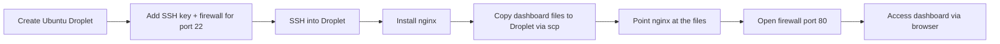

# Web App Deployment on DigitalOcean

Provisioned a cloud server from scratch: created the droplet, generated an SSH key pair and used it (not a password) to authenticate, and locked the Cloud Firewall down to only the access actually needed. This repo also includes PrintFlow, a small 3D-print job dashboard I built, which this droplet is set up to serve.

## Why This Exists

Before you can automate anything with Jenkins or Kubernetes, you need to understand what a deployment actually involves at the server level: a real Linux box, a real network boundary, and a real process running on it. This project was about doing that manually first, provisioning a server and controlling exactly what's exposed on it, so the CI/CD tooling I'm learning next has something real underneath it instead of being magic.

## Workflow



## What I Did

**1. Provisioned the droplet**
Created an Ubuntu droplet in DigitalOcean and generated an SSH key pair locally (`ssh-keygen`) rather than relying on password login. Added the public key during droplet creation so DigitalOcean would authorize it automatically.

**2. Locked the firewall down to what was needed, early**
Attached a Cloud Firewall to the droplet with only port 22 (SSH) open at first. Nothing else was reachable until I explicitly opened it later, rather than leaving the server wide open by default.

**3. Connected over SSH**
Logged in with `ssh root@<droplet-ip>` using the key pair instead of a password. Confirmed I could also authenticate as a non-root user where `authorized_keys` was set up, since running everything as root long-term isn't good practice.

## Deploying the Dashboard

The droplet itself is already provisioned and locked down (see above). The remaining steps describe how the PrintFlow dashboard (`index.html`, `styles.css`, `script.js`) gets served from it.

**4. Install nginx on the server**
`sudo apt update && sudo apt install nginx -y`, then confirm it's running with `systemctl status nginx`.

**5. Copy the dashboard files to the droplet**
Use `scp` to copy the three files from a local machine to the server, into the directory nginx serves static content from (`/var/www/html/`).

**6. Point nginx at the files and reload**
Confirm nginx's default site config serves from that directory, then reload it with `sudo systemctl reload nginx`.

**7. Open firewall access for HTTP**
Add a Cloud Firewall rule for TCP port 80, on top of the SSH rule already in place, then reach the dashboard in a browser at `http://<droplet-ip>`.

## Skills Demonstrated

Linux server provisioning and administration, SSH key-based authentication (generating and installing keys instead of relying on passwords), cloud firewall configuration scoped to only the ports actually needed, static site hosting with nginx, remote file transfer with `scp`, and building the front-end app being deployed (vanilla HTML, CSS, and JavaScript, no framework).

## Repo Structure

```
.
├── index.html      # PrintFlow dashboard markup
├── styles.css      # Dashboard styling
├── script.js       # Renders job cards from a data array
└── README.md
```

## Key Commands

```
# SSH key setup
ssh-keygen -C "shahtaj@device"
cat ~/.ssh/id_ed25519.pub

# Connect to the droplet
ssh -i ~/.ssh/your_private_key root@your_droplet_ip

# Install nginx on the server
sudo apt update
sudo apt install nginx -y
systemctl status nginx

# Copy the dashboard files from your machine to the droplet
scp -i ~/.ssh/your_private_key index.html styles.css script.js root@your_droplet_ip:/var/www/html/

# Reload nginx after copying files
sudo systemctl reload nginx
```

## Notes & Limitations

Replace placeholder values like `your_droplet_ip` and `your_private_key` with real deployment details. The dashboard currently renders a hardcoded array of sample print jobs in `script.js`, there's no backend yet; that's the next repo in this pipeline (a Node/Express API with a real database). This setup also runs everything as root with no TLS in front of it, both things a production deployment would add.

## Related Projects

This is the first step in a small pipeline I built across three repos. [Nexus_Repository_Manager](https://github.com/shahtaj2102/Nexus_Repository_Manager) sets up an artifact repository on a droplet provisioned the same way, and [Docker-and-Containers](https://github.com/shahtaj2102/Docker-and-Containers) containerizes an app and pushes the image to that registry.

Shahtaj Singh Gill - [LinkedIn](https://www.linkedin.com/in/shahtaj-aws-sap-toronto/) / [GitHub](https://github.com/shahtaj2102)
