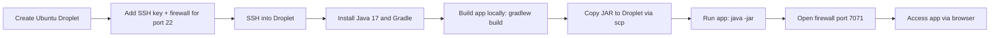

# Web App Deployment on DigitalOcean

Provisioned a cloud server from scratch and deployed a Java/Spring Boot app to it: created the droplet, set up SSH key authentication, installed the runtime, built the app, shipped the artifact to the server, and opened exactly the firewall access needed to reach it from a browser.

**Note on context:** This is hands-on lab work from the TechWorld with Nana DevOps bootcamp (Module 5). The app itself (`app/`, a Java + React example) is a pre-built third-party example project (originally from [pmendelski/java-react-example](https://github.com/pmendelski/java-react-example)) used to practice the deployment flow, not something I wrote. I'm disclosing that rather than letting it look like more than it is. The droplet provisioning, SSH setup, build, and firewall configuration are the parts I actually did.

## Why This Exists

Before you can automate anything with Jenkins or Kubernetes, you need to understand what a deployment actually involves at the server level: a real Linux box, a real network boundary, and a real process running on it. This project was about doing that manually first, provisioning a server, moving a build artifact onto it, and running it, so the CI/CD tooling I'm learning next has something real underneath it instead of being magic.

## Workflow



## What I Did

**1. Provisioned the droplet**
Created an Ubuntu droplet in DigitalOcean, sized for the app, and generated an SSH key pair locally (`ssh-keygen`) rather than relying on password login. Added the public key during droplet creation so DigitalOcean would authorize it automatically.

**2. Locked the firewall down to what was needed, early**
Attached a Cloud Firewall to the droplet with only port 22 (SSH) open at first. Nothing else was reachable until I explicitly opened it later, rather than leaving the server wide open by default.

**3. Connected over SSH**
Logged in with `ssh root@<droplet-ip>` using the key pair instead of a password. Confirmed I could also authenticate as a non-root user where `authorized_keys` was set up, since running everything as root long-term isn't good practice.

**4. Installed the runtime on the server**
Installed OpenJDK 17 and Gradle with `apt`, then verified both with `java --version` and `gradle --version` before trying to run anything.

**5. Built the application locally**
Cloned the example app and ran `./gradlew build` on my own machine rather than on the droplet, producing the packaged JAR under `build/libs/`. Keeping the build off the server keeps the droplet's job simple: run the artifact, don't compile it.

**6. Shipped the artifact to the server**
Used `scp` to copy the built JAR from my local machine to the droplet, authenticating with the same SSH key rather than a password.

**7. Ran the app and checked it actually started**
Started it with `java -jar`, and checked the logs for Spring Boot's startup confirmation and the port it bound to, instead of assuming a clean exit meant success.

**8. Opened just enough firewall access to reach it**
Added a second Cloud Firewall rule for TCP port 7071 (the app's port), on top of the SSH rule from step 2, then accessed it in the browser at `http://<droplet-ip>:7071`. SSH access on 22 stayed open for ongoing administration.

## Skills Demonstrated

Linux server provisioning and administration, SSH key-based authentication (generating and installing keys instead of relying on passwords), cloud firewall configuration scoped to only the ports actually needed, building a JVM application from source with Gradle, remote artifact transfer with `scp`, running and verifying a server-side Java process from its logs, and basic separation of build and runtime environments.

## Repo Structure

```
.
├── app/          # java-react-example, third-party example app used for this deployment exercise
└── README.md
```

## Key Commands

```bash
# SSH key setup
ssh-keygen -C "shahtaj@device"
cat ~/.ssh/id_ed25519.pub

# Connect to the droplet
ssh -i ~/.ssh/your_private_key root@your_droplet_ip

# Install runtime on the server
sudo apt update
sudo apt install openjdk-17-jdk gradle -y
java --version
gradle --version

# Build locally
./gradlew build

# Ship the artifact
scp -i ~/.ssh/your_private_key build/libs/java-react-example.jar root@your_droplet_ip:/root

# Run it
java -jar java-react-example.jar
```

## Notes & Limitations

Replace placeholder values like `your_droplet_ip` and `your_private_key` with real deployment details. This lab runs the app directly as root on port 7071 with no reverse proxy or TLS in front of it, both things a production setup would add. Firewall source ranges here are left open to all IPv4/IPv6 for simplicity; a real deployment would scope that down further.

## Related Projects

This is the first step in a small pipeline I built across three repos. [`Nexus_Repository_Manager`](https://github.com/shahtaj2102/Nexus_Repository_Manager) sets up an artifact repository on a droplet provisioned the same way, and [`Docker-and-Containers`](https://github.com/shahtaj2102/Docker-and-Containers) containerizes an app and pushes the image to that registry.

---
Shahtaj Singh Gill - [LinkedIn](https://www.linkedin.com/in/shahtaj-aws-sap-toronto/) / [GitHub](https://github.com/shahtaj2102)
